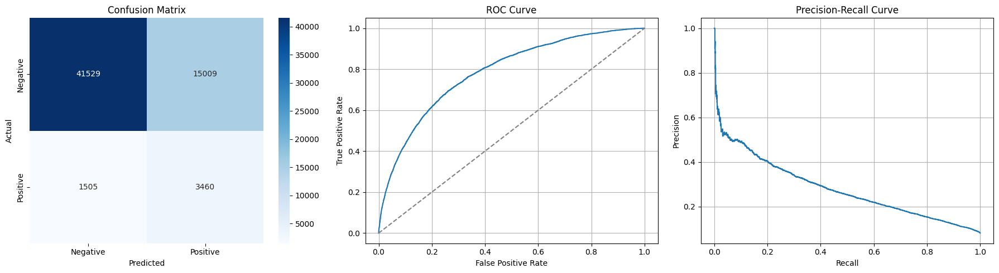
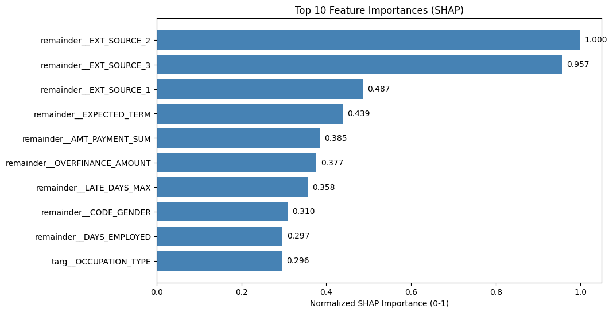

# Project overview

#### Dataset description
The [**Home Credit Default Risk**](https://www.kaggle.com/competitions/home-credit-default-risk/overview) dataset from the **Home Credit Group** has over 307,000 examples. It contains a mixture of flags/booleans, numbers, and categorical values. Additional CSVs provide historical and external credit data for feature engineering.

#### Target variable and eval. metrics
The target variable is `TARGET`, the likelihood that an applicant will default on their loan. The primary evaluation metric is the **area under the ROC curve**, which measures the models' abilities to rank defaulters above non-defaulters.

#### Goal
Build a model that ranks applicants by likelihood of defaulting.

#### Layout
- **Data**: Where the .csv files containing data are placed. This folder is not present in the repo due to the large file sizes.
- **Notebooks**: The three notebooks used in the pipeline.
  - `00_data_prep` contains code for splitting the data into train and val sets, along with adding aggregated features from files with multiple rows per user, and synthetic features.
  - `01_eda` contains EDA for many things, including correlation, missing values, and analysis of some features which performed well in lightgbm's SHAP importance.
  - `02_modeling` contains model training and analysis.
- **Saved**: Where data is stored in between notebooks, along with storing model .pkl and output .csv.  This folder is not present in the repo due to the large file sizes.
- **Scripts**: Contains test prediction script for test metrics on Kaggle.
- **Utils**: Backend files for notebooks.
- **notes.md**: Documentation for experiments performed to increase model performance.
- **config.yaml**: Configs for setup and models.

# Modeling approach

#### Model choices
I picked the models dummy classifier, logistic regression, random forest, and lightgbm for different reasons. Dummy classifier provided a basic sanity baseline with minimal setup effort. Logistic regression was also simple to implement, providing a good secondary baseline. For random forest, I chose it because it was a classic tree-based model, allowing it to capture more nuances than the previous two. Finally, I chose lightgbm, as it was a fast and efficient model.

Originally, I used all four models to compare their performance on the dataset. After initial testing, including randomized and grid hyperparameter search, I concluded that lightgbm performed significantly better than the remaining models. After that point, all experiments (as documented in **notes.md**) were purely performed on lightgbm until the end.

Additionally, due to logistic regression's low initial performance, I decided to not create tailored features meant for its linear preferences. In the end, I decided to feed it the same features as all of the other models, likely leading to its low performance. Had it been given its preferred features, though, its performance likely would not have met or exceeded lightgbm as the majority of the used features captured non-linear trends.

#### Resampling choices
Because of the model's heavily imbalanced label distribution, with the positive class making up only 8.1% of the examples, I decided to use resampling. I initially tried using SMOTEEN, but it lowered model performance. Trying undersampling with RandomUnderSampler, the model's performance increased. Starting at a sampling strategy of .5, I tested different values, ending up with .3 which improved the model's performance the most.

#### Feature engineering
Aggregated features were created from many of the .csv files, summarizing per-user statistics. Additionally, synthetic features helped capture relationships that the raw features themselves did not capture. Two of these features were very important to lightgbm, landing in the top 10 most SHAP important features.

#### Model interpretability
SHAP summary and SHAP waterfall helped reveal key insights into the model's decision making, influencing steps such as feature engineering. By understanding why and how the model performed, more effective actions were able to be taken to improve performance.

# Results

#### Model performance metrics
Lightgbm performed well above the baseline models, scoring 14.95 AUC points more than logistic regression, and 27.84 more than the dummy classifier. While the dummy classifier had very similar accuracy to lightgbm, it is misleading in an imbalanced dataset like this, where the positive class makes up only 8.1% of the examples. For the remaining metrics (F1, precision, and recall), lightgbm also took first place, well above the baseline models.

Overall, lightgbm scored an average of:
- Roc_auc: 78.16% ± 0.21%
- Accuracy: 72.97% ± 0.24%
- F1: 29.12% ± 0.11%
- Precision: 18.47% ± 0.09%
- Recall: 68.75% ± 0.52%

In the cross-validation metrics, with cross validation being done over five folds. On the Kaggle leaderboard, the model got 78.272 on public and 77.945 on private.

#### Model generalization
Different steps were taken to prevent over/underfitting by the models. Leakage was prevented through many ways, such as removing the label from the training data, ensuring that all target encoding was done uniquely within all cross-validation folds, and more. Lightgbm had consistent cross-validation scores, even when compared to validation or test scores. From cross-validation scores on lightgbm to its performance on the Kaggle private leaderboard, the model only dropped ~0.26 AUC points, which is within expected variance. This shows that the model has effective generalization skills.

# Next steps

While lightgbm performed well, there are many more things that could be done given more time. Since this was a portfolio project and not a live competition submission, I focused on model development rather than leaderboard optimization. More time could be spent doing more experiments (as documented in **notes.md**) to boost model performance. Additionally, further steps could be taken towards dimensionality reduction in order to improve speed of the model's predictions.

If ever used in production, basic drift sanity checks would also be a necessity. As the economy continues to change, trends found by these models may shift, whether between features or between a feature and the label. Retraining may be needed to improve future performance.